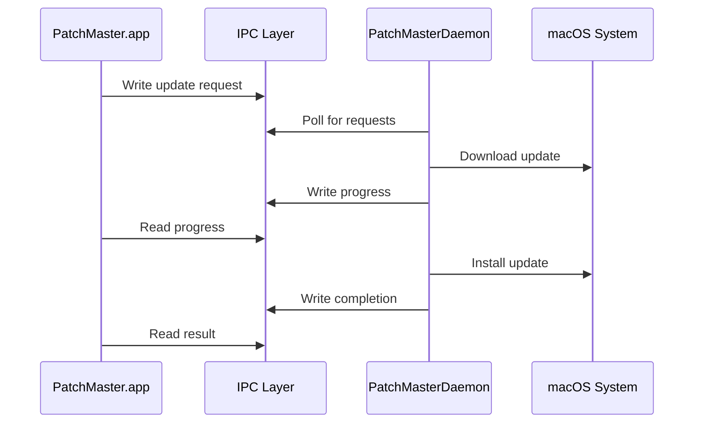

# PatchMaster

<p align="center">
  <strong>Automated 3rd Party Patching app for macOS</strong>
</p>

<p align="center">
  <a href="#features">Features</a> •
  <a href="#installation">Installation</a> •
  <a href="#usage">Usage</a> •
  <a href="#architecture">Architecture</a> •
  <a href="#development">Development</a>
</p>

## Overview

PatchMaster is a native macOS application that consolidates patch management for the apps isntalled on your Mac by using multiple sources including IntuneBrew, Homebrew, and native app update mechanisms. It provides a unified interface for discovering, downloading, and installing updates with elevated privileges through a secure daemon architecture.

## Screenshots

### Main Interface

*The main window showing available updates from all sources*

### Update in Progress

*Real-time download and installation progress tracking*

### Update Complete

*Successful update notification*

## Features

### 🔍 Multi-Source Update Detection
- **IntuneBrew Integration**: Checks enterprise-focused app catalog
- **Homebrew Support**: Scans installed Homebrew casks for updates
- **Native Updates**: Detects apps with built-in update mechanisms (e.g., Parallels Desktop)
- **Intelligent Version Comparison**: Smart version parsing handles various formats

### 🚀 Automated Installation
- **One-Click Updates**: Install updates without manual intervention
- **Privileged Daemon**: Secure installation with root privileges
- **Progress Tracking**: Real-time download and installation progress
- **Error Handling**: Graceful error recovery with retry options

### 🛡️ Security & Architecture
- **Signed & Notarized**: Apple Developer ID signed and notarized
- **IPC Communication**: Secure inter-process communication via file-based IPC
- **Minimal Privileges**: Daemon runs with only required permissions
- **SwiftUI Native**: Built with modern macOS technologies

### 🎯 Enterprise Ready
- **Intune Compatible**: Deployable via Microsoft Intune
- **Silent Installation**: Supports unattended deployment
- **Logging**: Comprehensive logging for troubleshooting

## System Requirements

- **macOS**: 15.5 or later
- **Architecture**: Universal (Intel & Apple Silicon)
- **Privileges**: Admin required for installation
- **Storage**: ~10 MB for app + daemon
- **Memory**: Minimal (~50 MB runtime)

## Installation

### Method 1: Package Installer (Recommended)

1. Download `PatchMaster-Unified.pkg` from [Releases](https://github.com/pathaksomesh06/PatchMaster/releases)
2. Double-click the package
3. Follow installer prompts
4. Enter admin password when requested

### Method 2: Homebrew (Coming Soon)

```bash
brew install --cask patchmaster
```

### Method 3: Manual Installation

```bash
# Clone repository
git clone https://github.com/pathaksomesh06/PatchMaster/git
cd PatchMaster

# Copy app
sudo cp -R PatchMaster.app /Applications/

# Install daemon
sudo cp PatchMasterDaemon /Library/PrivilegedHelperTools/
sudo chmod 755 /Library/PrivilegedHelperTools/PatchMasterDaemon
sudo chown root:wheel /Library/PrivilegedHelperTools/PatchMasterDaemon

# Install LaunchDaemon
sudo cp com.mavericklabs.patchmaster.daemon.plist /Library/LaunchDaemons/
sudo chmod 644 /Library/LaunchDaemons/com.mavericklabs.patchmaster.daemon.plist
sudo chown root:wheel /Library/LaunchDaemons/com.mavericklabs.patchmaster.daemon.plist

# Load daemon
sudo launchctl load /Library/LaunchDaemons/com.mavericklabs.patchmaster.daemon.plist
```

### Method 4: Enterprise Deployment (Intune)

1. Upload `PatchMaster-Unified.pkg` to Intune
2. Configure as macOS LOB app:
   - **App type**: macOS (PKG)

## Architecture

### Components

```
PatchMaster/
├── PatchMaster.app              # Main SwiftUI application
│   ├── UpdateChecker           # Core update detection logic
│   ├── DaemonCommunicator      # IPC client implementation
│   └── UI Components           # SwiftUI views
│
├── PatchMasterDaemon           # Privileged helper daemon
│   ├── AppInstaller           # DMG/PKG installation logic
│   ├── DownloadManager        # Async download handling
│   └── IPC Server             # Request processing
│
└── IPC Layer                   # File-based communication
    ├── /tmp/patchmaster-ipc/requests/   # Incoming requests
    ├── /tmp/patchmaster-ipc/responses/  # Command responses
    └── /tmp/patchmaster-ipc/progress/   # Progress updates
```

### Communication Flow



### Security Model

- **Code Signing**: Signed with Developer ID
- **Notarization**: Apple notarized for Gatekeeper
- **Privilege Separation**: UI runs as user, daemon as root
- **IPC Security**: File permissions restrict access

## Usage

### Basic Operation

1. **Launch**: Open PatchMaster from Applications
2. **Scan**: Automatically scans on launch
3. **Review**: See available updates with version info
4. **Update**: Click "Update" button for desired apps
5. **Monitor**: Watch real-time progress
6. **Complete**: App restarts automatically if needed


### Update Sources

#### IntuneBrew
- Curated enterprise app catalog
- Direct download URLs
- Version tracking

#### Homebrew
- Scans installed casks
- Compares with formulae.brew.sh
- Supports custom taps

#### Native Updates
- Parallels Desktop (`prlctl`)
- More coming soon

## Configuration

### Preferences (Coming Soon)

- Update check frequency
- Automatic update options
- Source prioritization
- Notification settings

## Troubleshooting

### Common Issues

#### App Won't Launch
```bash
# Check daemon status
sudo launchctl list | grep patchmaster

# Reload if needed
sudo launchctl unload /Library/LaunchDaemons/com.mavericklabs.patchmaster.daemon.plist
sudo launchctl load /Library/LaunchDaemons/com.mavericklabs.patchmaster.daemon.plist
```

#### No Updates Found
```bash
# Check IPC permissions
ls -la /tmp/patchmaster-ipc/
sudo chmod -R 777 /tmp/patchmaster-ipc

# Force refresh
rm -rf ~/Library/Caches/com.mavericklabs.PatchMaster
```

#### Installation Fails
```bash
# Check logs
cat /var/log/patchmaster.log
tail -f /var/tmp/pm-install.log

# Verify daemon
ps aux | grep PatchMasterDaemon
```

### Log Locations

- **Daemon log**: `/var/log/patchmaster.log`
- **Install log**: `/var/tmp/pm-install.log`
- **App log**: `~/Library/Logs/PatchMaster/app.log`

### Project Structure

```
PatchMaster/
├── PatchMaster/              # Main app target
│   ├── Models/              # Data models
│   ├── Views/               # SwiftUI views
│   ├── ViewModels/          # Business logic
│   └── Services/            # Update checkers
│
├── PatchMasterDaemon/       # Daemon target
│   ├── main.swift          # Entry point
│   ├── Services/           # Core services
│   └── Utilities/          # Helper functions
│
└── Shared/                  # Shared code
    ├── IPC/                # IPC protocols
    └── Models/             # Shared models
```
## Contributing

### Guidelines

1. Fork the repository
2. Create feature branch
3. Commit changes 
4. Push to branch
5. 5. Open Pull Request

### Code Style

- SwiftLint configuration included
- Follow Apple's Swift API Design Guidelines
- Document public APIs
- Include unit tests

## Uninstallation

### Complete Removal

```bash
#!/bin/bash
# Uninstall PatchMaster

# Stop daemon
sudo launchctl unload /Library/LaunchDaemons/com.mavericklabs.patchmaster.daemon.plist

# Remove files
sudo rm -rf /Applications/PatchMaster.app
sudo rm -f /Library/LaunchDaemons/com.mavericklabs.patchmaster.daemon.plist
sudo rm -f /Library/PrivilegedHelperTools/PatchMasterDaemon
sudo rm -rf /tmp/patchmaster-ipc

# Remove preferences
defaults delete com.mavericklabs.PatchMaster
rm -rf ~/Library/Caches/com.mavericklabs.PatchMaster
rm -rf ~/Library/Logs/PatchMaster

# Remove package receipts
sudo pkgutil --forget com.mavericklabs.patchmaster
sudo pkgutil --forget com.mavericklabs.patchmaster.daemon
```

## License

This project is licensed under the MIT License.

## Acknowledgments

- [IntuneBrew](https://github.com/ugurkocde/IntuneBrew) - Enterprise app catalog
- [Homebrew](https://brew.sh) - Package manager integration

---

<p align="center">
  Made with ❤️ for Intune - by Somesh Pathak
</p>
