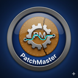

# PatchMaster

<div align="center">



**A comprehensive software update management tool for macOS**

[](https://www.apple.com/macos/)
[](https://swift.org/)
[](LICENSE)
[](https://developer.apple.com/documentation/security/notarizing_macos_software_before_distribution)

[Features](#-features) • [Installation](#-installation) • [Usage](#-usage) • [Development](#-development) • [Contributing](#-contributing)

</div>

---

## 📖 Overview

PatchMaster is a macOS application that consolidates software updates from multiple sources into a single, unified interface. It automatically detects available updates from Sparkle feeds, Homebrew casks, and native app update mechanisms, allowing you to keep all your applications up-to-date with minimal effort.

### Why PatchMaster?

- **Unified Interface**: Check and install updates from multiple sources in one place
- **Automated Detection**: Automatically scans installed apps and finds available updates
- **Enterprise Ready**: Designed for deployment via Microsoft Intune and other MDM solutions
- **Secure**: Code-signed and notarized by Apple, runs with proper privilege separation
- **Modern UI**: Beautiful SwiftUI interface with real-time progress tracking

## ✨ Features

### Multi-Source Update Detection

- **Sparkle Feeds**: Automatic detection of apps using Sparkle update framework (VS Code, GitHub Desktop, etc.)
- **Homebrew Casks**: Integration with Homebrew cask catalog for apps installed via Homebrew
- **Native Updates**: Support for apps with built-in update mechanisms (currently Parallels Desktop)

### Automated Installation

- One-click update installation
- Real-time progress tracking with live status updates
- Support for DMG, PKG, and ZIP formats
- Automatic retry on failure
- Smart process management (won't kill system processes)

### Enterprise Features

- Microsoft Intune compatible
- Signed and notarized by Apple
- Silent deployment support
- Privileged daemon for system-level operations
- Comprehensive logging

### User Experience

- Beautiful, modern SwiftUI interface
- Smooth animations and progress indicators
- Search functionality for large update lists
- Clear status messages during update checks
- Automatic system cache refresh after installations


## 🚀 Installation

### System Requirements

- **macOS**: 11.0 (Big Sur) or later
- **Architecture**: Intel or Apple Silicon
- **RAM**: 512 MB minimum
- **Disk**: 10 MB free space
- **Privileges**: Administrator (for daemon installation)

### Quick Install

1. Download the latest release from [Releases](https://github.com/pathaksomesh06/PatchMaster/releases/tag/v1.0)
2. Open `PatchMaster-Unified.pkg`
3. Follow the installation wizard
4. Launch PatchMaster from Applications

### Verification

After installation, verify everything is working:

```bash
# Check app installation
ls -la /Applications/PatchMaster.app

# Verify daemon is running
sudo launchctl list | grep patchmaster

# Check signatures
pkgutil --check-signature PatchMaster-Unified.pkg
spctl -a -vvv -t install PatchMaster-Unified.pkg
```

### What Gets Installed

```
/Applications/PatchMaster.app                                    # Main application
/Library/PrivilegedHelperTools/PatchMasterDaemon               # Update daemon
/Library/LaunchDaemons/com.mavericklabs.patchmaster.daemon.plist # Auto-start
/tmp/patchmaster-ipc/                                          # IPC directories
```

## 📱 Usage

### First Launch

1. Launch PatchMaster from Applications
2. The app will automatically scan for installed applications
3. Wait for the initial scan to complete (30-60 seconds)
4. Available updates will be displayed in the main window

### Checking for Updates

- Updates are checked automatically on launch
- Click the **Refresh** button to manually check for updates
- Progress indicators show:
  - "Scanning installed apps..."
  - "Checking native updaters..."
  - "Checking Sparkle feeds..."
  - "Checking Homebrew catalog..."
  - "Finalizing results..."

### Installing Updates

1. Review the list of available updates
2. Click **Update** on any app you want to update
3. Monitor progress in real-time
4. The app will automatically refresh after installation

### Search

Use the search bar to quickly find specific apps in large update lists.

## 🏗 Architecture

PatchMaster uses a client-daemon architecture for security and privilege separation:

### Components

- **Main App** (`PatchMaster.app`): SwiftUI application running as the current user
- **Daemon** (`PatchMasterDaemon`): Privileged helper tool running as root
- **IPC**: JSON-based file communication in `/tmp/patchmaster-ipc/`

### Update Detection Flow

1. **App Scanning**: Scans `/Applications`, `/Applications/Utilities`, and other common locations
2. **Filtering**: Excludes Microsoft Office apps, Apple system apps, and legacy/problematic apps
3. **Native Updates**: Checks apps with built-in update mechanisms first
4. **Sparkle Feeds**: Checks apps with `SUFeedURL` in Info.plist
5. **Homebrew**: Checks remaining apps against Homebrew cask catalog
6. **Version Comparison**: Uses intelligent version comparison to filter false positives

### Security

- Daemon runs with root privileges only when needed
- App runs as current user
- All communication via file-based IPC
- Code-signed and notarized
- Hardened runtime enabled

## 🛠 Development

### Prerequisites

- Xcode 15.0 or later
- macOS 11.0+ SDK
- Swift 5.9+
- Code signing certificate (for building)

### Building

```bash
# Clone the repository
git clone https://github.com/pathaksomesh06/PatchMaster.git
cd PatchMaster

# Open in Xcode
open PatchMaster.xcodeproj

# Build
xcodebuild -project PatchMaster.xcodeproj -scheme PatchMaster -configuration Release
```

### Project Structure

```
PatchMaster/
├── PatchMaster/              # Main SwiftUI application
│   ├── ContentView.swift     # Main UI
│   ├── UpdateViewModel.swift # Business logic
│   └── DaemonCommunicator.swift # IPC client
├── PatchMasterDaemon/        # Privileged daemon
│   ├── main.swift            # Daemon entry point
│   ├── UpdateChecker.swift   # Update detection logic
│   ├── AppScanner.swift      # App discovery
│   ├── SparkleUpdateChecker.swift
│   ├── HomebrewChecker.swift
│   └── AppInstaller.swift    # Installation logic
└── package/                  # Distribution package
```

### Running Tests

```bash
xcodebuild test -project PatchMaster.xcodeproj -scheme PatchMaster
```

### Creating Distribution Package

See `script.sh` for the complete build and packaging process.

## 🐛 Troubleshooting

### Daemon Not Running

```bash
# Check daemon status
sudo launchctl list | grep patchmaster

# Restart daemon
sudo launchctl unload /Library/LaunchDaemons/com.mavericklabs.patchmaster.daemon.plist
sudo launchctl load /Library/LaunchDaemons/com.mavericklabs.patchmaster.daemon.plist
```

### Reset Application

```bash
# Clear app preferences and cache
defaults delete com.mavericklabs.PatchMaster
rm -rf ~/Library/Caches/com.mavericklabs.PatchMaster
```

### View Logs

```bash
# Daemon log
cat /var/log/patchmaster.log

# Installation log
cat /var/log/patchmaster-install.log

# Console.app
# Search for "PatchMaster" or "PatchMasterDaemon"
```

### Common Issues

**Issue**: Updates not showing after installation
- **Solution**: Wait 10-15 seconds for system cache refresh, then click Refresh

**Issue**: Timeout errors during update check
- **Solution**: Update check timeout is 10 minutes. If it times out, check network connectivity and try again.

**Issue**: "Permission denied" errors
- **Solution**: Ensure daemon is running as root: `sudo launchctl list | grep patchmaster`

## 📋 Known Limitations

- Microsoft Office apps are excluded (use Microsoft AutoUpdate)
- Apple system apps are excluded (use Software Update)
- Some legacy/problematic apps are excluded (Docker Toolbox, VirtualBox, etc.)
- First launch scan takes 30-60 seconds
- Large downloads (>1GB) may require retry

## 🔮 Roadmap

- [ ] Scheduled update checks
- [ ] Update history tracking
- [ ] Custom update source configuration
- [ ] Preferences UI
- [ ] Notification Center integration
- [ ] Additional native updater support
- [ ] Batch update installation
- [ ] Update notifications

## 🤝 Contributing

Contributions are welcome! Please feel free to submit a Pull Request.

1. Fork the repository
2. Create your feature branch (`git checkout -b feature/AmazingFeature`)
3. Commit your changes (`git commit -m 'Add some AmazingFeature'`)
4. Push to the branch (`git push origin feature/AmazingFeature`)
5. Open a Pull Request

### Development Guidelines

- Follow Swift style guidelines
- Add tests for new features
- Update documentation as needed
- Ensure code is signed and builds successfully

## 📄 License

This project is licensed under the MIT License.

## 🙏 Acknowledgments

- [Homebrew](https://brew.sh/) maintainers for the cask API
- [Sparkle](https://sparkle-project.org/) framework developers
- Apple for SwiftUI and macOS development tools

## ⭐ Star History

If you find PatchMaster useful, please consider giving it a star on GitHub!

---

<div align="center">

Made with ❤️ for macOS

**PatchMaster** - Keeping your apps up-to-date, effortlessly

</div>

